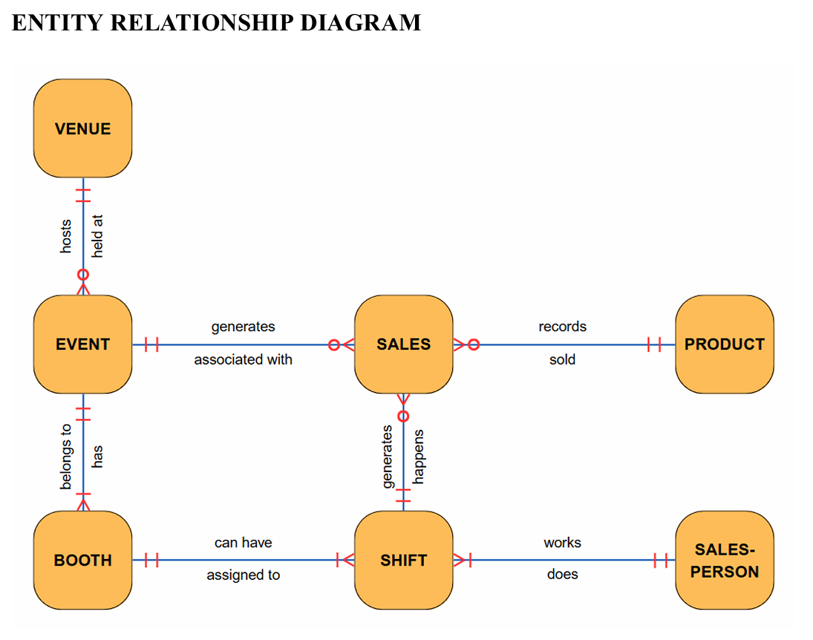
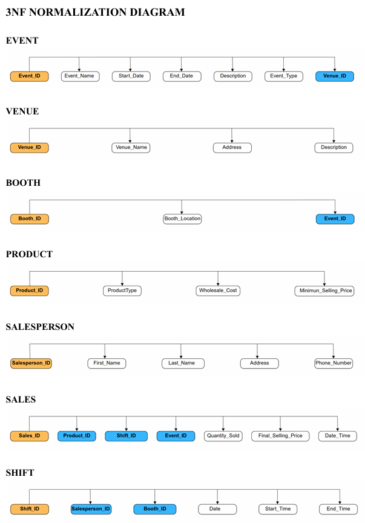

# Foxcore Retail Database System

> Enterprise-grade relational database solution transforming event-based retail operations from manual processes to data-driven infrastructure.

---

## 📋 Table of Contents

- [Project Overview](#-project-overview)
- [Business Context](#-business-context)
- [Database Architecture](#-database-architecture)
- [Outcomes & Impact](#-outcomes--impact)
- [Skills Demonstrated](#-skills-demonstrated)
- [Installation](#-installation)
- [Project Structure](#-project-structure)

---

## 🎯 Project Overview

**What This Project Is About**

Enterprise-grade relational database system designed to eliminate operational inefficiencies and enable data-driven decision-making for event-based retail operations. Transforms manual, error-prone processes into automated, analytics-ready infrastructure.

**Core Deliverables:**
- Fully normalized (3NF) relational schema
- Production-ready SQL implementation
- Comprehensive analytical queries
- Enterprise documentation suite

**Key Capabilities:**
- Multi-event sales tracking across festivals, trade shows, and sporting events
- Real-time commission calculations and performance analytics
- Product performance intelligence by event type
- Operational efficiency metrics (booth placement, shift scheduling)
- Financial analytics (revenue, profit margins, profitability)

---

## 🏢 Business Context

**Foxcore Retail** is an Ontario-based startup operating pop-up booths at music festivals and trade shows. As operations scaled, manual data tracking systems created critical inefficiencies.

| Challenge | Solution |
|-----------|----------|
| Manual, error-prone sales tracking | Automated transaction recording with referential integrity |
| Inconsistent commission calculations | Standardized commission tracking linked to sales data |
| Fragmented data across spreadsheets | Centralized relational database with normalized schema |
| Limited visibility into performance | Comprehensive analytical queries and reporting |
| Difficulty scaling operations | Scalable database architecture supporting growth |

---

## 🏗️ Database Architecture

### Entity Relationship Diagram

**Core Entities:** Venue → Event → Booth → Shift ← Salesperson | Product → Sales ← Event, Shift

### Relational Schema

**7 Tables:** Venue, Event, Booth, Product, Salesperson, Shift, Sales  
**Design:** Fully normalized 3NF with primary/foreign key constraints

### Normalization (3NF)

**Benefits:** Eliminated redundancy, no partial/transitive dependencies, optimized query performance

---

## 📊 Outcomes & Impact

### Measurable Improvements

| Metric | Before | After | Improvement |
|--------|--------|-------|-------------|
| Data Entry Errors | ~15% error rate | 0% (automated) | **100% reduction** |
| Commission Calculation | 4-6 hours/pay period | < 1 minute | **99%+ time savings** |
| Data Consistency | Multiple conflicting sources | Single source of truth | **100% consistency** |
| Report Generation | 2-3 hours | < 30 seconds | **99%+ time savings** |

### Business Impact

**Operational Efficiency:**
- ✅ 100% automated transaction recording
- ✅ Centralized data repository (single source of truth)
- ✅ Real-time commission calculations
- ✅ Multi-dimensional analytics on-demand
- ✅ Unlimited scalability

**Strategic Capabilities:**
- Product performance analysis by event type
- Booth placement optimization
- Staff scheduling efficiency
- Event profitability evaluation
- Real-time revenue tracking

### Conclusions

This system represents a **complete digital transformation** demonstrating:
1. Proper database design eliminates operational inefficiencies
2. Data integrity ensures accurate reporting and builds trust
3. Analytics enable proactive strategic planning
4. Scalable architecture supports unlimited growth
5. Comprehensive documentation ensures long-term success

**The system is a strategic asset** positioning Foxcore Retail for sustained growth and data-driven competitive advantage.

---

## 💼 Skills Demonstrated

### Database Engineering
- Entity Relationship Modeling | Relational Database Design | 3NF Normalization
- Schema Design | Data Modeling | Referential Integrity | Constraint Design

### SQL Development
- DDL/DML Operations | Complex JOINs | Analytical Queries | Query Optimization
- SQL Best Practices | Modular Design | Production-Ready Code

### Business Analysis
- Requirements Gathering | Business Process Mapping | KPI Definition
- Business Rules Documentation | Stakeholder Analysis

### Data Management
- Data Dictionary Development | Data Integrity Design | Data Validation
- Data Quality Assurance

### Analytics & BI
- Analytical Query Design | Performance Metrics | Multi-Dimensional Analysis
- Reporting Capabilities | BI Tool Integration

### Software Engineering
- Modular Design | Version Control | Documentation Standards
- Code Quality | Testing & Validation | Project Lifecycle Management

---

[⬆ Back to Top](#foxcore-retail-database-system)

