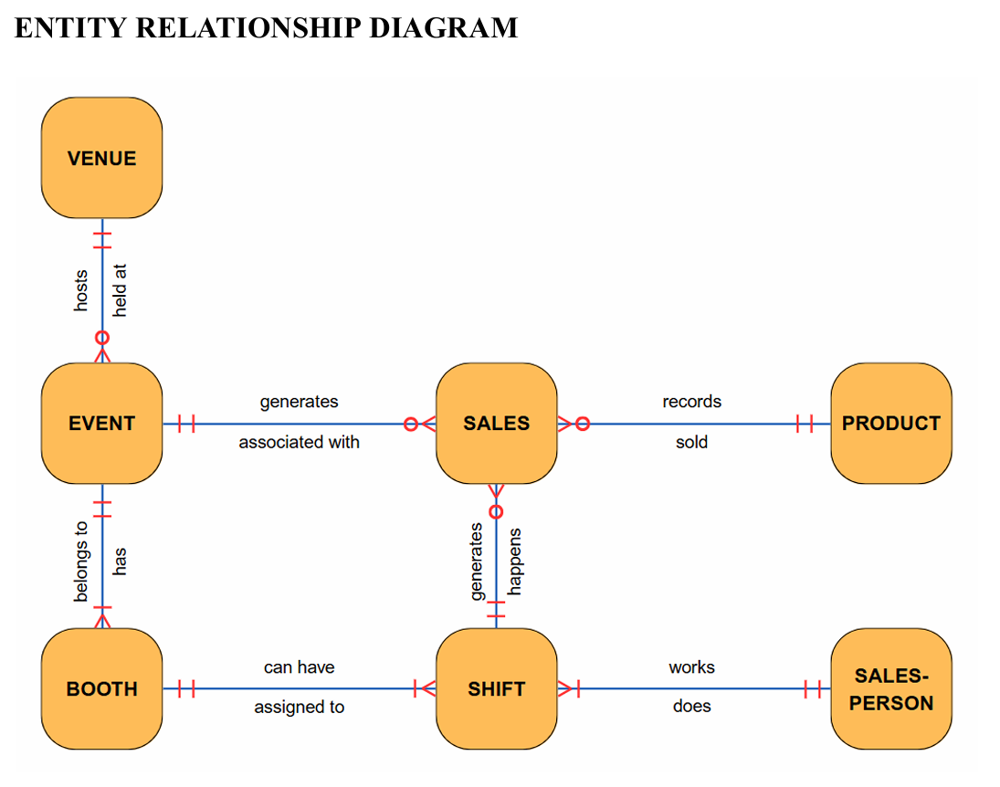
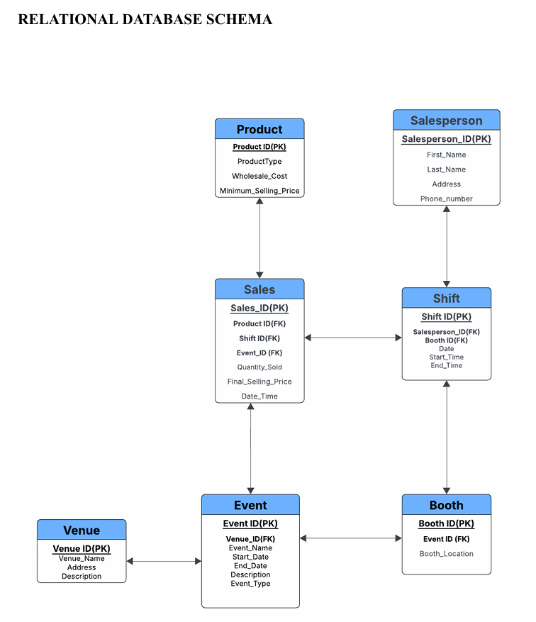
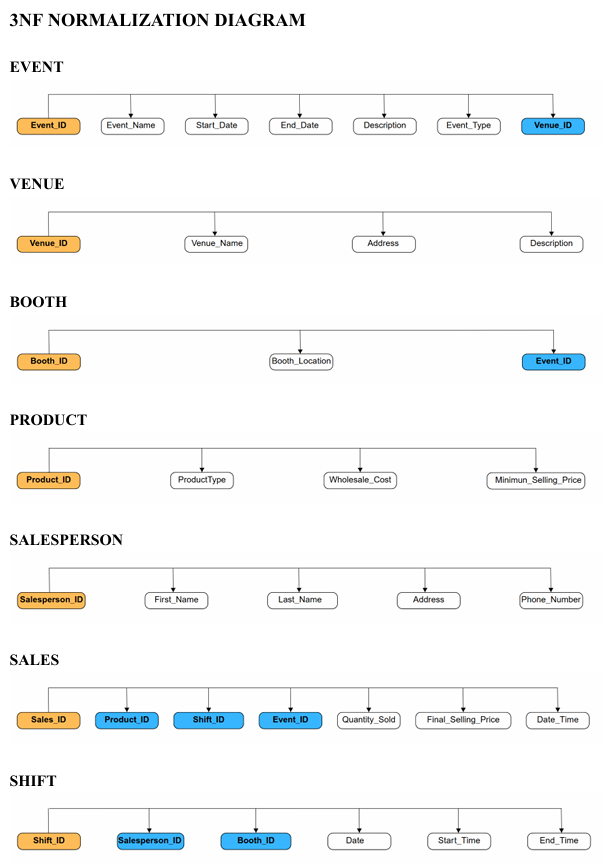

<p align="center">
  
</p>

<p align="center">
  
  
  
  
  
</p>

---

Two founders scaled a seasonal pop-up across Ontario venues while staff still recorded sales on paper. Commissions were error-prone, nobody could compare product performance across event types, and each new festival added another silo of numbers. The case calls for a disciplined data model that connects every sale to a shift, booth, event, venue, product, and salesperson. **This work delivers that model: third-normal-form tables arranged as a star schema, foreign-key integrity end to end, and six analytical queries that answer inventory, payroll, and placement questions in one pass.**

> Case study (Ivey Publishing): [Foxcore Retail (A): Designing a Database](<docs/Case Study - Foxcore Retail.pdf>)

---

<table width="100%">
<tr>
<td align="center" width="25%" valign="top">
<h1>7</h1>
<hr>
normalized tables
</td>
<td align="center" width="25%" valign="top">
<h1>6</h1>
<hr>
analytical SQL queries
</td>
<td align="center" width="25%" valign="top">
<h1>4-6 hr</h1>
<hr>
commission reconciliation (spreadsheet era)
</td>
<td align="center" width="25%" valign="top">
<h1>4</h1>
<hr>
tables in the deepest analytic JOIN path
</td>
</tr>
</table>

---

## Contents

| **Section** | **What you'll find** |
|---|---|
| [Project snapshot](#project-snapshot) | Quick-glance specs |
| [The problem](#the-problem) | Why paper and spreadsheets failed the operation |
| [Data](#data) | Case source and what ships in this repo |
| [Three design layers](#three-design-layers) | Conceptual, logical, and physical views |
| [Analysis](#analysis) | Workflow, diagrams, and the six business queries |
| [Key findings](#key-findings) | What the schema implies for analytics |
| [Recommendations](#recommendations) | How the business should use the system |
| [Reproduce it](#reproduce-it) | Clone, run scripts in order |

---

## Project snapshot

| **Domain** | Retail operations, event-based pop-up sales |
|---|---|
| **Context** | Ivey Publishing case study -- *Foxcore Retail (A): Designing a Database* (Neufeld, Corrigan & Gencarelli, 2018) |
| **Course** | MAX 506 -- Database Design & SQL, Stuart SChool of Business |
| **Tools** | SQL (DDL, DML, multi-table analytics) |
| **Methods** | ER modeling, 3NF normalization, star schema, referential integrity |
| **Deliverables** | `Sales` fact table, six dimensions (`Venue`, `Event`, `Booth`, `Product`, `Salesperson`, `Shift`), six BI queries |

---

## The problem

The company sells at music festivals, fitness expos, and sports events. Staff rotate through booths; each transaction should trace to who sold what, where, and when. Growth turned informal record-keeping into a bottleneck: separate tallies per event or salesperson, manual commission math, no standard way to rank products by event type, and no evidence for which booth placements paid off.

| **Friction** | **Effect** |
|---|---|
| Fragmented records | Reconciliation across sheets before any cross-event view |
| Manual commissions | Multi-hour payroll work each period, dispute risk |
| No shared product–event view | Merchandising and replenishment decisions made blind |
| Untracked placement | Booth negotiation without revenue-by-location facts |

The teaching question is how to represent the full chain -- venue through event, booth, shift, salesperson, sale, and product -- so that integrity holds and analytics are one query away.

---

## Data

The scenario, operating context, and modeling brief match the Ivey case named in the [project snapshot](#project-snapshot). The published case does not include a redistributable data dump; the team built the implementation from the requirements narrative.

This repository contains:

- **Executable SQL** in [code/](code/) -- table creation, seed data, update/delete exercises, and six analytical queries documented in the [Group 2 project report (PDF)](docs/Project Report.pdf)
- **Design documentation** -- [ARCHITECTURE.md](docs/ARCHITECTURE.md) and [DATABASE_DICTIONARY.md](docs/DATABASE_DICTIONARY.md)
- **Figures** in [assets/](assets/) -- ERD, relational schema, and 3NF dependency notes used in the report

> Licensing: obtain the case PDF through your school or [Ivey Publishing](https://www.iveypublishing.ca/s/product/foxcore-retail-a-designing-a-database/01t5c00000CwoXfAAJ); do not redistribute proprietary case text here.

---

## Three design layers

The project moves from narrative requirements to a physical schema the same way the case sequence suggests: conceptual entities first, then normalized structure, then implementable tables.

<table width="100%">
<tr>
<td align="center" width="33%" valign="top">
<h3>Conceptual</h3>
<hr>
Entities, relationships, and cardinality for venues, events, booths, products, salespeople, shifts, and sales<br><br><b>Tests:</b> Does the ER diagram cover every noun in the case?
</td>
<td align="center" width="33%" valign="top">
<h3>Logical</h3>
<hr>
Third normal form: atomic fields, full key dependency, no transitive attributes<br><br><b>Tests:</b> Can you update a product price in one row without side effects?
</td>
<td align="center" width="33%" valign="top">
<h3>Physical</h3>
<hr>
Star layout for analytics: `Sales` as the fact; dimensions for context<br><br><b>Tests:</b> Do FKs enforce every parent-child path the queries traverse?
</td>
</tr>
</table>

`Shift` doubles as the bridge that assigns a salesperson to a booth for a time window, which is how labor connects to location for commission logic.

---

## Analysis


```mermaid
flowchart LR
    A["Case requirements"] --> B["ER model"]
    B --> C["3NF + star decisions"]
    C --> D["DDL + constraints"]
    D --> E["Seed transactions"]
    E --> F["Six BI queries"]
```

<p align="center">
  
</p>

<p align="center">
  
</p>

<p align="center">
  
</p>

> Deeper design notes: [ARCHITECTURE.md](docs/ARCHITECTURE.md) · Column-level reference: [DATABASE_DICTIONARY.md](docs/DATABASE_DICTIONARY.md)

The six queries below map directly to the business questions in the project report; each is multi-table and relies on the keys above.

<table width="100%">
<tr>
<th align="left" width="5%">#</th>
<th align="left" width="30%">Question</th>
<th align="left" width="35%">Output</th>
<th align="left" width="30%">Join spine</th>
</tr>
<tr>
<td>1</td>
<td>Product performance by event</td>
<td>Revenue and units by product × event</td>
<td>Sales → Product → Event</td>
</tr>
<tr>
<td>2</td>
<td>Salesperson totals and commission</td>
<td>Per-person sales; commission at 10%</td>
<td>Sales → Shift → Salesperson</td>
</tr>
<tr>
<td>3</td>
<td>Revenue by event type</td>
<td>Totals and average ticket by category</td>
<td>Sales → Event</td>
</tr>
<tr>
<td>4</td>
<td>Shift productivity</td>
<td>Revenue per shift with worker and window</td>
<td>Sales → Shift → Salesperson</td>
</tr>
<tr>
<td>5</td>
<td>Booth performance</td>
<td>Counts, units, revenue by booth within event</td>
<td>Sales → Shift → Booth → Event</td>
</tr>
<tr>
<td>6</td>
<td>Product profitability</td>
<td>Margin % and profit using cost vs. realized price</td>
<td>Sales → Product</td>
</tr>
</table>

---

## Key findings

**1. Analytics starts at the fourth join.** Booth-level insight needs `Sales`, `Shift`, `Booth`, and `Event` aligned; a single flat export cannot preserve those keys without redundancy or orphan rows.

**2. Commissions become a query, not a spreadsheet formula.** Linking each sale to a shift and salesperson removes duplicate counting when one person covers multiple booths or events in a pay period.

**3. Event type stratification changes assortment.** Query 1 and 3 together separate "what sold" from "where the money came from by category," which is how a pop-up operator decides what to pack for the next festival type.

**4. Margin and volume diverge.** Query 6 shows that unit leaders are not always margin leaders; without wholesale cost in the same grain as selling price, merchandising overweights top-line SKUs.

---

## Recommendations

**Treat the star schema as the system of record for operations.** Enter venues, events, booths, products, and staff through the constrained tables so every new sale inherits valid foreign keys; ad-hoc sheets become exports from the database, not the source.

**Run commission and payroll from Query 2.** Use the same definition of "who earned what" for disputes and planning; if the rule changes (e.g., rate other than 10%), change it once in the query or a view.

**Use Query 5 in venue negotiations.** Bring location-level revenue to the next contract conversation instead of negotiating on intuition alone.

**Pair Query 1 with Query 6 before reordering.** Rebalance inventory toward high-margin winners at the event types where they actually move, not only where units spike.

**Keep methodology in version control.** Document assumption changes (commission rules, new dimensions) in [docs/methodology.md](docs/methodology.md) so the model stays aligned with the case brief as the course or business evolves.

---

## Reproduce it

```bash
git clone https://github.com/sai-seetal-pendyala/sql-retail-database-design-analytics.git
cd sql-retail-database-design-analytics
```

**Run in MySQL, PostgreSQL, or SQL Server (order matters):**

```sql
-- code/01_create_tables.sql
-- code/02_insert_data.sql
-- code/03_update_delete.sql
-- code/04_analytical_queries.sql
```

---

<p align="center">
  Part of <b>Sai Seetal Pendyala</b>'s Analytics Portfolio<br>
  <a href="https://www.linkedin.com/in/sai-seetal-pendyala/">LinkedIn</a> · <a href="https://github.com/sai-seetal-pendyala">GitHub</a>
</p>
